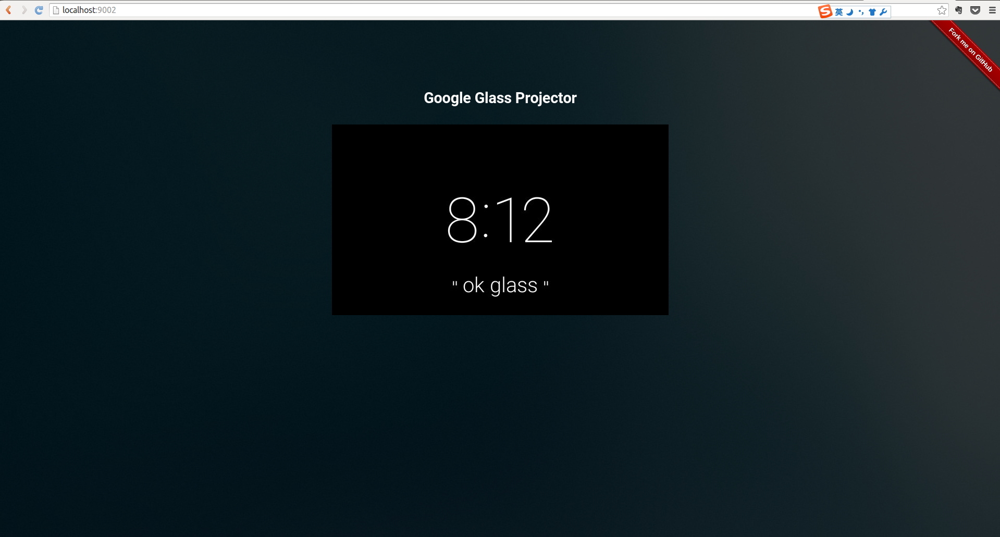

# GoogleGlassProjector

Google Glass Projector is a tool to stream Google glass screen to PC in real time, which might help developers test and debug their google wear applications.

This project is based on [*minicap*](https://github.com/openstf/minicap), which can work without ROOT via ADB on SDK 22 and lower.

<p align="center">
  
</p>

## Features
- stream Google glass screen to PC in real time smoothly with almost zero latency.
- (TODO) gesture control via web. The common operations on Google glass include swipe forward, swipe back, swipe down and tap.

## How to Use

### Requirements

- [*NDK*](https://developer.android.com/tools/sdk/ndk/index.html)
- [*make*](http://www.gnu.org/software/make/)
- [*nodejs*](https://nodejs.org)
- since [*minicap*](https://github.com/openstf/minicap) includes [*android-libjpeg-turbo*](https://github.com/openstf/android-libjpeg-turbo) as a submodule, before building and running, fetch it first:
```
git submodule init
git submodule update
```

### Building and Running

- make sure the Google glass turns debug on and is well connected with PC. You can test it via the command:
```
adb devices
```

- the easiest way to run this project is just to use the `installGlass.sh` provided in the root folder. This script will build the project using `ndk-build`, install the binary files on the devices, run these binary files and turn on ADB forward, on port 1717 by default. The parameter, `autosize` means to select the correct display size automatically, particularly 640*360 for Google glass. You can use the custom parameters by `-P {width}x{height}@{width}x{height}/0` as well. Use `-h` to check the help information.
```
./installGlass.sh autosize
```
- then run the script `pcserver.sh`. It will help install the necessary node modules and setup a web server on localhost:9002 by default.
```
./pcserver.sh
```
- open `http://localhost:9002` in your browser.

## TODO

- ADD debug information on the web page.
- ADD gesture control.
